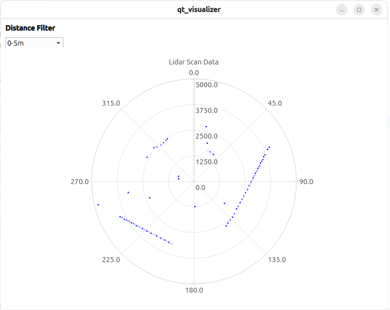

# QT Visualizer

I played around with a simple 2D lidar and wanted to make sense of what lidar
generates. What I ended up doing is to create a standlone QT server which listens
on UDP with proto text formating. 

That is launching `./qt_visualizer` binary which blocks and waits for the incoming UDP
packets and then in another terminal launching `./smoke_test_main` which feeds these
protos in text format:

```prototext
items {
  theta: 45414
  distance_mm: 2294
  quality: 60
}
items {
  theta: 46620
  distance_mm: 4797
  quality: 60
}
```

which shows data in the `PolarChartView`



### Why not combining plot with getting data from lidar?

Initially I was going to do just that. If you want to use some sort of QT, then QT will
usurp the whole project. There will be a main QT application with their own data models,
macros, events, two compilers and a lot more. My main project was in Bazel. It is possible
to [use QT in Bazel](https://github.com/bashtavenko/qt_exp), but it would be a lot simpler
with CMake especially that I can use Absceil, protos, glog and other libraries that I need. 
